# Authorship

A place to write a novel inside VS Code.

Your manuscript stays a file — markdown, in your own repository, with your own
history. Authorship adds an editor that understands what a story is made of, a
reader that tells you what is wrong with a passage, and a way out to an EPUB.
Every model it uses runs on your machine; nothing you write is sent anywhere.

<!-- CAPTURE hero.webp — the whole VS Code window with a `.author` manuscript
     open: the toolbar across the top of the editor, three or four sections down
     the page (a Chapter section followed by prose), the sidebar open on
     the left, the status bar reading "Authorship: ok". Use a real story, not
     lorem ipsum. Full window, light or dark to taste — one screenshot in each
     theme is better if you have the patience. -->

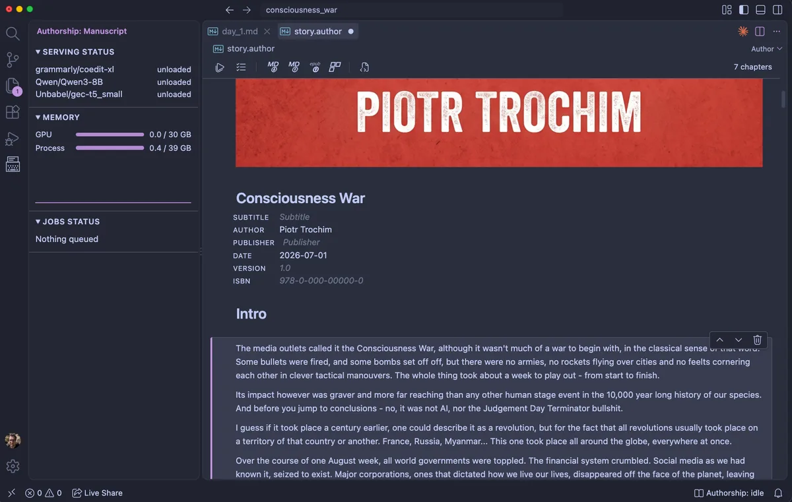

---

## Contents

- [First run](#first-run)
- [Starting a story](#starting-a-story)
- [The editor](#the-editor)
- [Sections](#sections)
- [Checking the prose](#checking-the-prose)
- [Writing a blurb](#writing-a-blurb)
- [Building the book](#building-the-book)
- [Dividing a long story into parts](#dividing-a-long-story-into-parts)
- [The Authorship sidebar](#the-authorship-sidebar)
- [The status bar](#the-status-bar)
- [The file format](#the-file-format)
- [Keyboard](#keyboard)
- [Commands](#commands)
- [Privacy](#privacy)
- [Troubleshooting](#troubleshooting)
- [Reporting a problem](#reporting-a-problem)

---


### What it needs

| | |
|---|---|
| VS Code | 1.125 or newer |
| Platforms | macOS (Apple silicon and Intel), Linux (x64, arm64), Windows (x64, arm64) |
| Disk | a few GB for the Python environment, plus roughly 20 GB of model weights, downloaded the first time each model is used |
| Memory | the models are allowed 24 GB between them; they load one at a time and are unloaded when something else needs the room |

The model weights are large because the work is done on your machine rather than sent
to somebody else's. If the disk is the problem, note that no model is fetched
until the first time you ask for the thing it does: you can write, export and
publish for as long as you like without ever downloading one.

---

## First run

The first time Authorship starts after an install or an update, it builds the
Python environment its models run in. This is a download of a few gigabytes and
takes a few minutes on a cold machine. It happens once per version, in the
background, with a notification saying how it is getting on — VS Code stays
usable throughout, and the editor works before it has finished.

Everything it installs goes into the extension's own storage — its own copy of
Python, its own packages, its own cache. Nothing is written into your project,
and nothing is put on your `PATH`: whatever Python you already have is left
exactly as it is.

If anything goes wrong, the whole story is in the **Authorship** output channel
(**View › Output**, then pick *Authorship* from the dropdown).

---

## Starting a story

A story lives in a `.author` file. There are two ways to get one.

**Start empty.** Make a new file called `story.author` — anything you like, so
long as it ends in `.author` — and open it. It opens in the Authorship editor
with a single empty section waiting for you.

**Bring a manuscript you already have.** Open a `.author` file and press
**Import Markdown** in the toolbar. Pick your existing `.md` manuscript and
Authorship reads its headings as the story's three levels — `#` is the title
page, `##` is a part, `###` is a chapter — with the prose beneath each heading
becoming the prose beneath each section. It replaces everything in the document,
so it asks first, and one `Ctrl+Z` / `Cmd+Z` puts it back.

<!-- CAPTURE import-markdown.webp — the Import Markdown file picker open over the
     editor, with a real .md manuscript selected in the story's own folder. -->

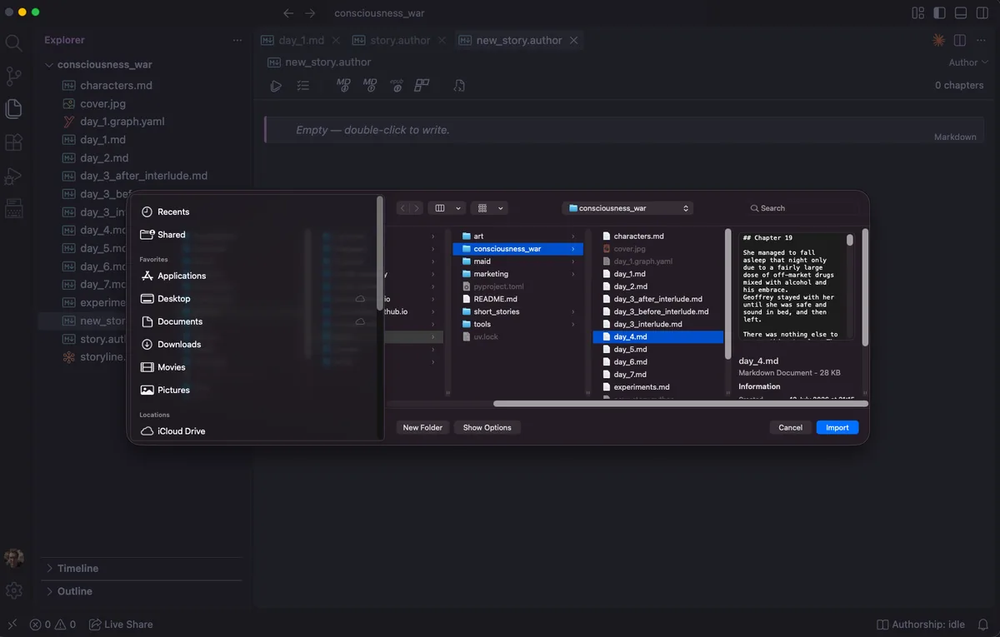

---

## The editor

A `.author` file opens as a page of **sections**, laid out the way a notebook
lays out cells: a narrow column down the left, the section filling the width
beside it, and what the section is named quietly in its bottom corner.

<!-- CAPTURE editor-anatomy.webp — one screen of the editor showing, in one
     frame: the toolbar, the run column on the left, a Chapter section, two
     prose sections under it, the kind label in a section's bottom corner, and
     the part · chapter line and word count in the toolbar. Annotate it with
     callouts if you like — this is the picture that explains the layout. -->

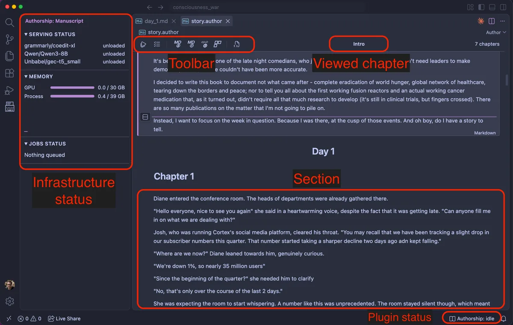

**Editing.** Double-click a section — or select it and press `Enter` — to type
in it. `Esc` or `Shift+Enter` finishes; clicking elsewhere does the same. What
you type is written into the file a moment after you stop, so Save, Save All,
the dirty dot and `Ctrl+Z` / `Cmd+Z` all behave exactly as they do in any other
editor. The document is the file; the page is a view of it.

**Where you are.** The line at the top of the toolbar names the part and chapter
you are reading, taken from what is on screen rather than from what you last
clicked — scroll through a hundred thousand words and it keeps up. The word
count sits at the other end.

**Splitting and joining.** Hover between two paragraphs and a line appears at
the nearest seam, with a button on it. Press it to cut the section in two there,
or — at the seam above a section — to join it to the one before.

<!-- CAPTURE split-seam.webp — the seam line drawn between two paragraphs of a
     prose section, with its split icon and the "Split the section here" tooltip
     showing. Crop tight: two or three paragraphs, the seam, the button. -->

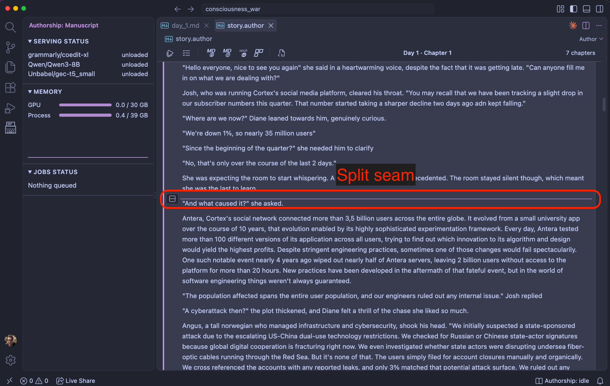

**Adding, moving, removing.** The strip in the gap between two sections adds
one *there*, which is nearly always what "add a chapter" means: a button each for
the kinds you reach for while writing — Markdown, Chapter, Note, Part — and a `…`
for every other kind. A section you are on carries its own buttons at the top
right: move up, move down, delete.

<!-- CAPTURE insert-menu.webp — the insert strip showing between two sections
     with its Markdown / Chapter / Note / Part buttons, and the `…` menu open
     beside it listing the remaining kinds (Title Page, Cover, Table of
     Contents, Disclaimer, About the Author, Blurb). -->

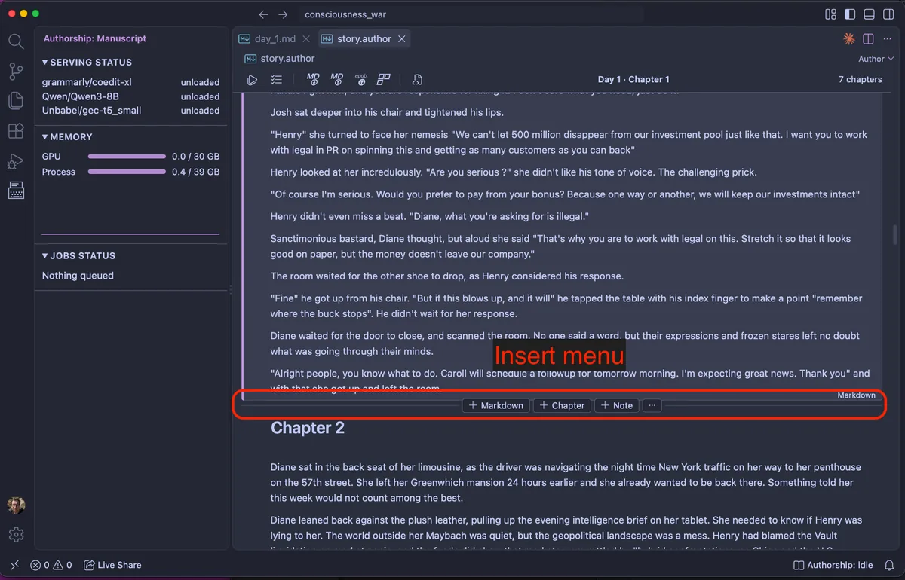

<!-- CAPTURE cell-actions.webp — a section hovered, with the move up / move down
     / delete buttons visible at its top right. -->

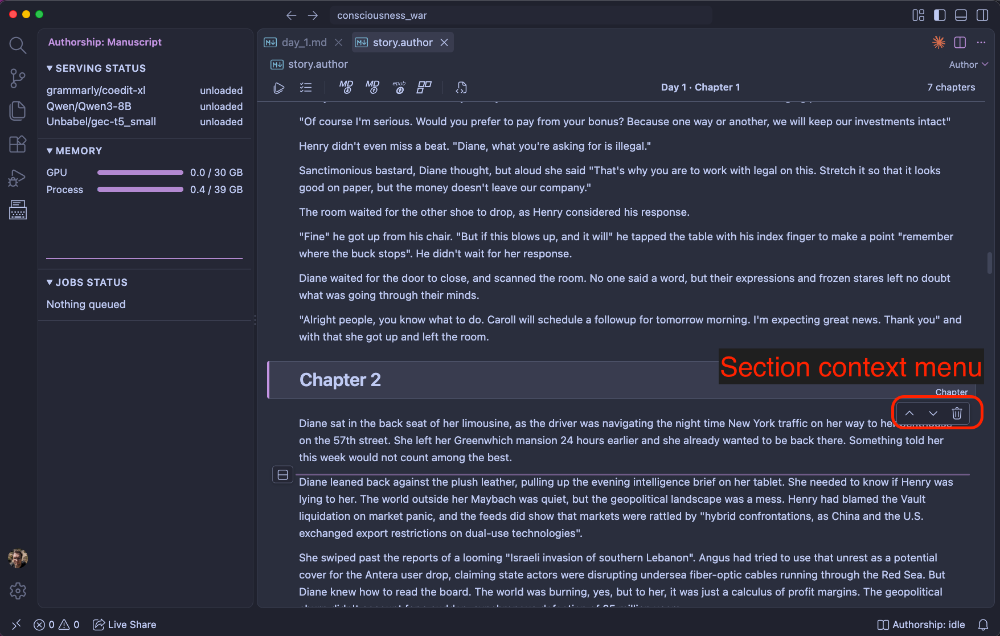

**Find and replace.** `Ctrl+F` / `Cmd+F` opens find over the whole document, and
`Ctrl+H` / `Cmd+Alt+F` opens replace under it. Match case, whole word and
regular expressions are all there; `F3` and `Shift+F3` step through the matches,
and the count tells you how many there are.

<!-- CAPTURE find-and-replace.webp — the find and replace bar open with a real query
     typed in, the match count showing, and matches highlighted in the prose
     behind it. -->

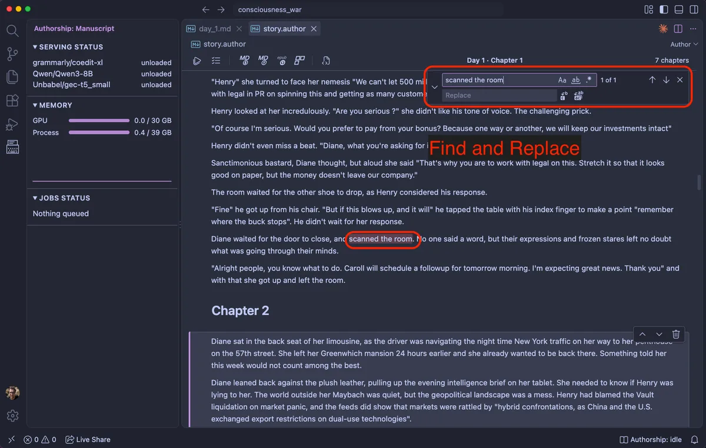

**Several cursors.** Select a word and press `Ctrl+D` / `Cmd+D` to put a cursor
on the next place the section says the same thing, and again for the one after.
Typing changes all of them at once; the arrow keys step them together; `Esc`
gives them up.

<!-- CAPTURE multi-cursor.webp — a section open for editing with three cursors on
     three occurrences of the same name, mid-rename. -->

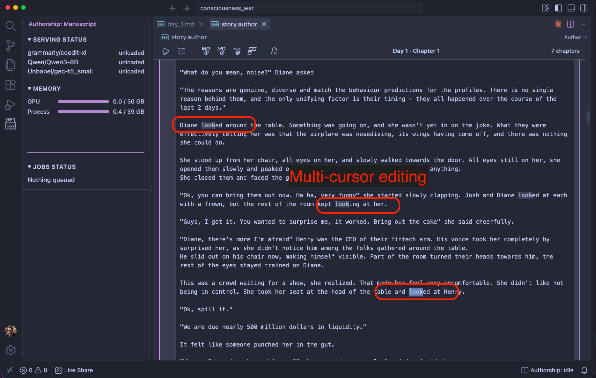

**The file underneath.** **View Source** in the toolbar opens the same file as
plain text, in VS Code's own markdown editor. It is the same document — edits in
either show up in the other, and git sees one file, not two.

<!-- CAPTURE view-source.webp — the .author file open as text beside the
     Authorship editor in a split, the same passage visible in both, with the
     cell markers showing on the text side. -->

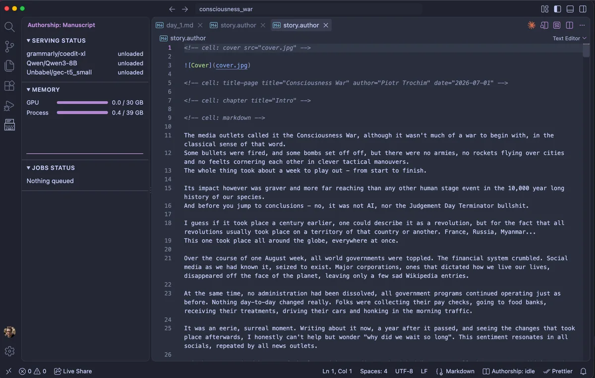

---

## Sections

A section's **kind** is what it is, and it is never guessed from what it says: a
chapter called "Disclaimer" is still a chapter.

| Kind | What it is |
|---|---|
| **Markdown** | Prose. Most of a novel is this. |
| **Chapter** | Names a chapter. Carries a title and no prose of its own, so moving it moves the name. |
| **Part** | Names a run of chapters, one level above a chapter. |
| **Note** | What you say to yourself about the story while writing it. It sits beside the passage it is about, and is never published. |
| **Title Page** | Title, subtitle, author, publisher, date, version, ISBN. |
| **Cover** | The cover art. |
| **Table of Contents** | Built from the chapters around it — see *Run All* below. |
| **Disclaimer** | The copyright and fiction notice, opening the book. |
| **About the Author** | Your own page, with optional links to KDP, a website, a Substack. |
| **Blurb** | The copy that sells the book. Written from the story, and not printed in it. |

Sections with fields — a title page, a chapter, an about page — show them as
labelled boxes rather than as prose you have to remember the shape of.

<!-- CAPTURE title-page-fields.webp — a Title Page section open, showing the
     labelled fields filled in with a real book's details. -->

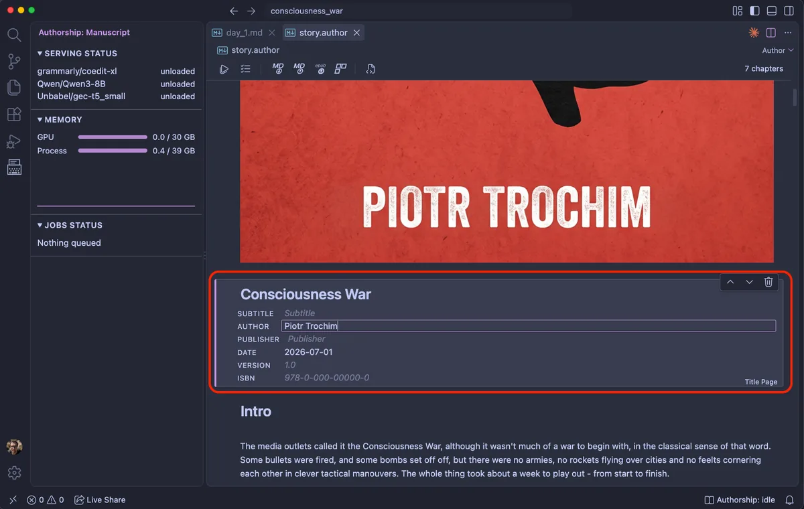

The order on the page is the order in the book. Move the disclaimer above the
title page here and it is above it in the EPUB; there is no second list of front
matter to keep in step.

---

## Checking the prose

Nothing is checked until you ask. Drafting is the other half of writing, and an
opinion arriving mid-sentence is an opinion nobody wanted. Press **Check Prose**
in the toolbar and Authorship reads the whole document once, then re-reads each
paragraph as you finish writing it.

<!-- CAPTURE check-prose.webp — a paragraph with several different underlines in
     it at once, the Check Prose button in the toolbar showing as on. Choose a
     passage with a real filter word, a real echo and a real passive in it. -->

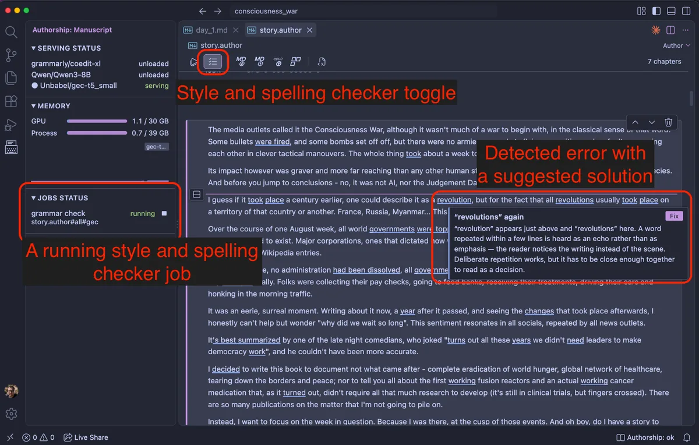

Two passes run: a set of rules that answers in milliseconds, and a grammar model
that takes a few seconds. The rules draw first and the model adds to what they
put up, so you are never waiting on the slowest thing in the report.

**What the rules look for**

| | |
|---|---|
| **Filter words** | A perception verb standing between the reader and what is perceived — *she saw the door open* rather than *the door opened*. |
| **Said-bookisms** | A dialogue tag doing work the line should be doing. |
| **Adverbial tags** | An adverb propping up a dialogue tag. |
| **Passive voice** | A sentence whose subject is having something done to it. |
| **Echoes** | A content word said twice inside the reader's hearing. Both halves are underlined — an underline under one of them says nothing. |
| **Openings** | Consecutive sentences that begin the same way. |
| **Monotony** | A run of sentences all of the same length. |
| **Crutch words** | The words *this manuscript* leans on, learned from the whole of it rather than from a list. |
| **Usage** | What proselint makes of the passage. |
| **Grammar** | A minimal-edit corrector reading a sentence at a time: it puts a comma in, it does not rewrite your prose. Each run of changed words becomes its own mark, so you can take the comma without swallowing four other opinions. |

**Stopping on a mark.** Hover an underline and a box says what is wrong and why.
Where the rule already knows what belongs there, the replacement is offered
outright. Where it does not, the **Fix** button asks the model for one — it
rewrites the marked phrase only, in your tense and register, and the fix is
thrown away unless the rule that found the fault agrees it is gone.

Marks live for as long as the editor is open and are written nowhere. What a
check thinks of your prose is not part of your prose.

---

## Writing a blurb

*Generative AI disclosure*: this functionality uses a locally running AI to create a draft of the blurb. It is highly advised to treat the generated blurb as a working draft rather than a finished section.

Add a **Blurb** section and press the run button in the column beside it. The
model reads the book the way a reader reads it — the first chapter, then each
chapter after it with the blurb so far — and what comes back at the end is the
blurb the story has earned. Nothing has to hold the whole manuscript at once, so
this works on a novel and not only on a short story.

The bar counts chapters, because that is the division the work actually has. You
can go on writing elsewhere while it reads, and the square button stops it.

<!-- CAPTURE blurb-writing.webp — a Blurb section mid-generation: the progress
     bar showing "3 of 21 chapters" or similar, the stop button in place of the
     run button. -->

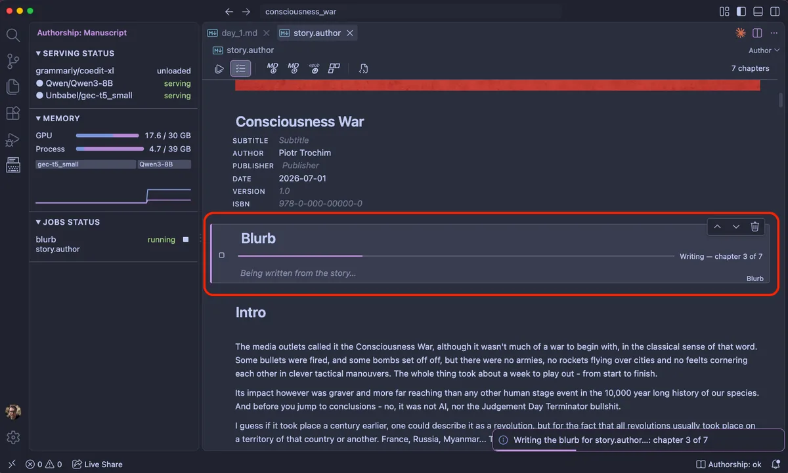

<!-- CAPTURE blurb-done.webp — the finished blurb sitting in its section. -->

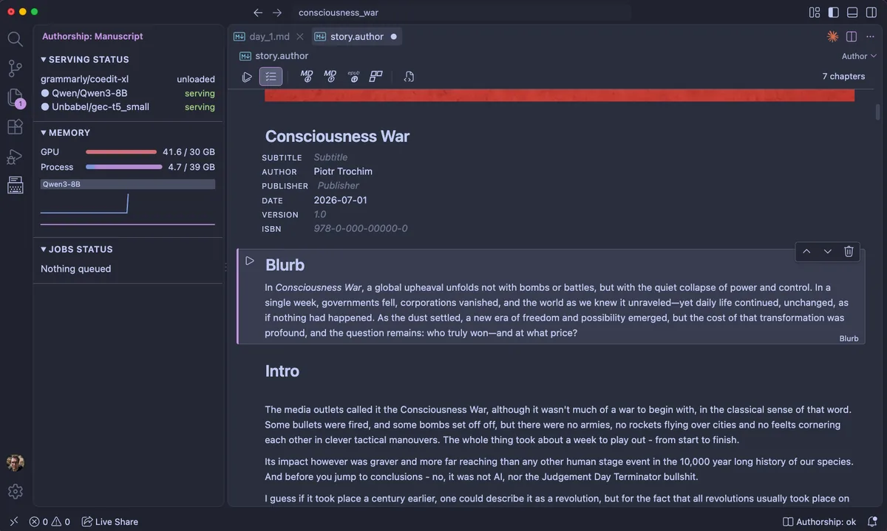

The blurb is written from the story alone: the notes in your margin, the
scaffolding of the format and any blurb already there are all kept out of it.
It is copy for a shop listing, so it is not printed in the book.

---

## Building the book

**Run All** builds every section that is built rather than written — today that
is the table of contents, made from the chapters around it in an instant. A
built section whose source has moved on says so in the column beside it, so you
can see at a glance what is stale.

**Export EPUB** binds the book beside the document. Everything it needs is in
the document itself — the title page names and credits it, the cover section
points at the art, the contents section asks for a table of contents, the
chapters are the story, and the disclaimer and about pages open and close it.
Notes and the blurb stay out. There is no second file carrying half the answer.

<!-- CAPTURE export-epub.webp — the "Exported story.epub" notification, with the
     new .epub visible in the Explorer. A second shot of the book open in a
     reader (Apple Books, Calibre) showing the cover and the table of contents
     is worth having too — save it as epub-in-reader.png. -->

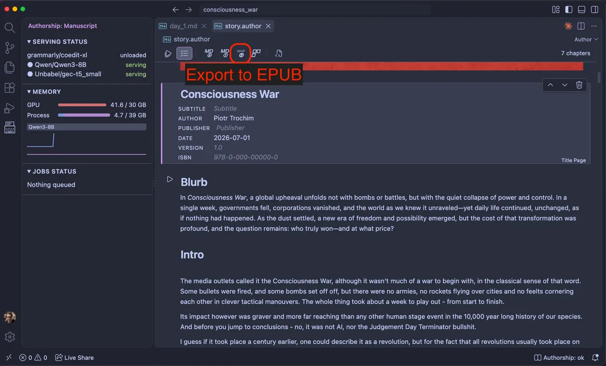

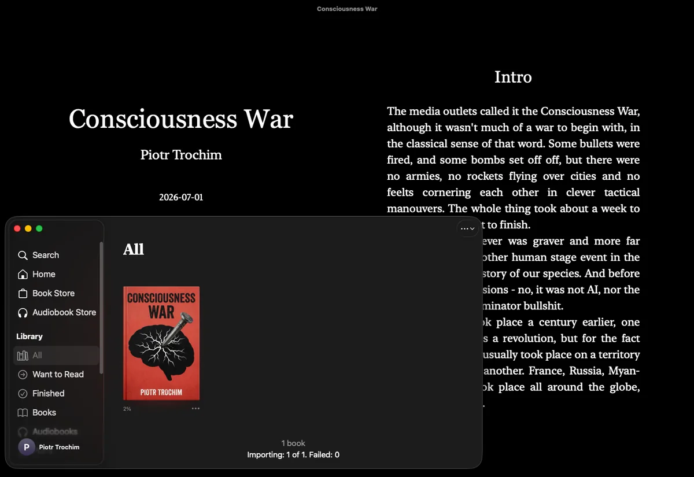

**Export Markdown** writes the document out as one plain markdown manuscript —
`story.author` becomes `story.md` beside it — for anywhere that wants a
manuscript and not a book.

---

## Dividing a long story into parts

**Divide into Parts** cuts the story into `parts/part_1.author`,
`part_2.author`, and so on, beside the document it came from. It asks about how
many words a part should be — 5,000 unless you say otherwise — and a story with
Parts of its own is also asked whether to keep them whole, so that no file spans
two of them.

The cuts fall between chapters, never mid-scene, so the lengths land near what
you asked for rather than exactly on it. Each part is a story document like any
other: it carries the book's furniture, its title page renumbered, and its share
of the chapters — and it opens in this editor and exports to an EPUB by the same
buttons.

<!-- CAPTURE divide-parts.webp — the "About how many words should a part be?"
     prompt, ideally the quick-pick form with the "along the story's own parts"
     tick, and the parts/ folder with part_1.author … part_5.author showing in
     the Explorer behind or beside it. Two shots stitched is fine. -->

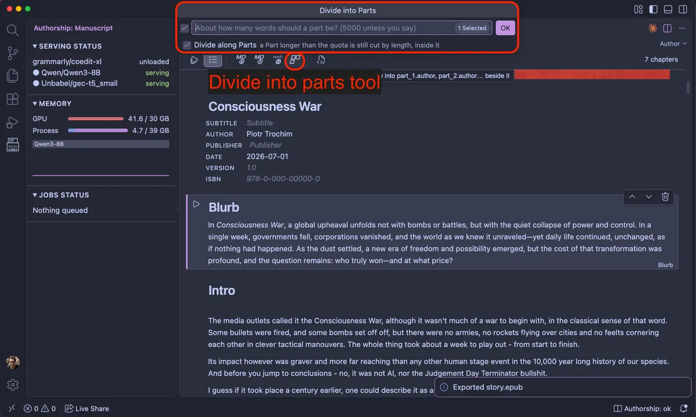

---

## The Authorship sidebar

The Authorship icon in the activity bar opens the **Manuscript** view, which
reports on the machinery rather than on the book: which models are resident,
what they are holding against what the machine has, and what work the server has
in hand. A running job can be stopped from here.

<!-- CAPTURE sidebar.webp — the Authorship sidebar with all three drawers
     populated: a model serving, a real memory reading, and at least one job in
     flight with its stop button. -->

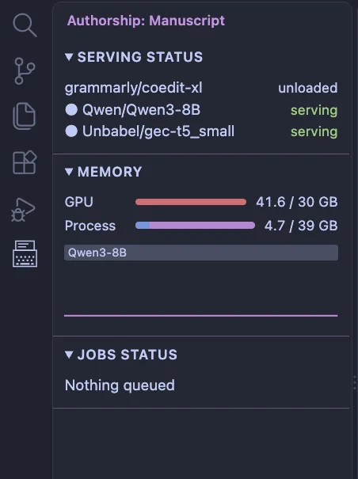

---

## The status bar

| Reads | Means |
|---|---|
| `Authorship: ok` | The model is loaded and serving. |
| `Authorship: idle` | The server is up; a model will load the first time something needs one. |
| `Authorship: downloading` | Fetching a model. This takes a while the first time. |
| `Authorship: offline` | Nothing is answering. See [Troubleshooting](#troubleshooting). |

---

## The file format

A `.author` file is markdown. What makes it a story document is that the
markdown is cut into sections, each opened by an HTML comment that says what the
section is:

```markdown
<!-- cell: chapter title="The First Night" -->

The lantern had gone out again.

<!-- cell: cover src="art/cover.jpg" -->
```

Three things follow from that, and they are the reason for it:

**Every markdown reader renders it.** The markers are comments, so GitHub, your
static site, and the preview pane all show the story and none of the
scaffolding.

**Plain markdown is already a story document.** A file with no markers reads as
one prose section holding the lot. Nothing you have written is locked out.

**Nothing is lost to a version that does not understand it.** A section kind
this editor has never heard of is carried through untouched, so a document
written by hand, or by a newer version, survives a round trip through an older
one.

And because the file is text and the editor edits the text, git behaves: a diff
of a chapter is a diff of that chapter, `git blame` says who wrote which line,
and a merge is a merge.

<!-- CAPTURE git-diff.webp — the VS Code diff view of a .author file with a real
     revision: a paragraph rewritten, the surrounding cell markers unchanged. -->

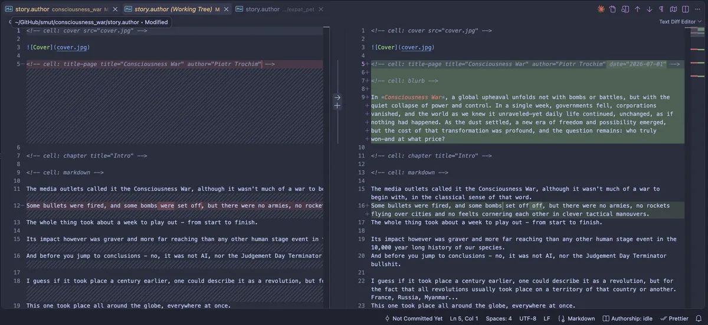

---

## Keyboard

| | |
|---|---|
| `Enter`, double-click | Open the section for typing |
| `Esc`, `Shift+Enter` | Finish typing in the section |
| `Ctrl+D` / `Cmd+D` | Add a cursor at the next occurrence of the selection |
| `←` `→` | Move every cursor together |
| `Esc` | Give up the extra cursors |
| `Ctrl+F` / `Cmd+F` | Find |
| `Ctrl+H` / `Cmd+Alt+F` | Replace |
| `F3` / `Shift+F3` | Next / previous match |
| `Esc` | Close find |
| `Ctrl+Z` / `Cmd+Z` | Undo — VS Code's own, because the document is the file |

## Commands

Every toolbar button is also a command, so it is in the Command Palette
(`Ctrl+Shift+P` / `Cmd+Shift+P`) and can be bound to a key of your own:

- `Authorship: Run All`
- `Authorship: Import Markdown`
- `Authorship: Export Markdown`
- `Authorship: Export EPUB`
- `Authorship: Divide into Parts`
- `Authorship: View Source`

<!-- CAPTURE command-palette.webp — the Command Palette open with "Authorship"
     typed, showing all six commands. -->

---

## Privacy

Everything runs on your machine. The models are downloaded once and then run
locally, against a server the extension starts on `127.0.0.1:8765` and talks to
over the loopback interface. Your manuscript is never uploaded, never sent to an
API, and never used to train anything. The only thing that goes out over the
network is the download itself: the installer, the Python packages and the model
weights.

---

## Troubleshooting

**The status bar says `offline`.** The model server is not answering. Open
**View › Output** and pick *Authorship* from the dropdown — an install that
failed or a server that exited says why there. Reloading the window
(`Developer: Reload Window`) starts it again.

**The first run is taking a long time.** It is downloading a Python interpreter
and several gigabytes of packages. The notification shows the line the installer
is on; the output channel shows all of them. It happens once per version.

**A check found nothing.** Checks are off until you press **Check Prose**. If
they are on and nothing is underlined, look at the status bar: the first check
after a start has to load a model, and the models are large.

**Export failed.** Exporting an EPUB is done by the local server, so it needs
the server up — see `offline`, above. Exporting markdown and dividing into parts
need nothing but the editor and work whatever the status bar says.

**Two windows, one server.** The first VS Code window to start the server serves
every window after it. Closing that window stops the server, and the windows
left behind read `offline` until one of them is reloaded
(`Developer: Reload Window`), which starts a new one.

---

## Reporting a problem

Please open an issue at
[github.com/robodatalab/writer](https://github.com/robodatalab/writer/issues),
with what the **Authorship** output channel said if the extension itself
misbehaved.
